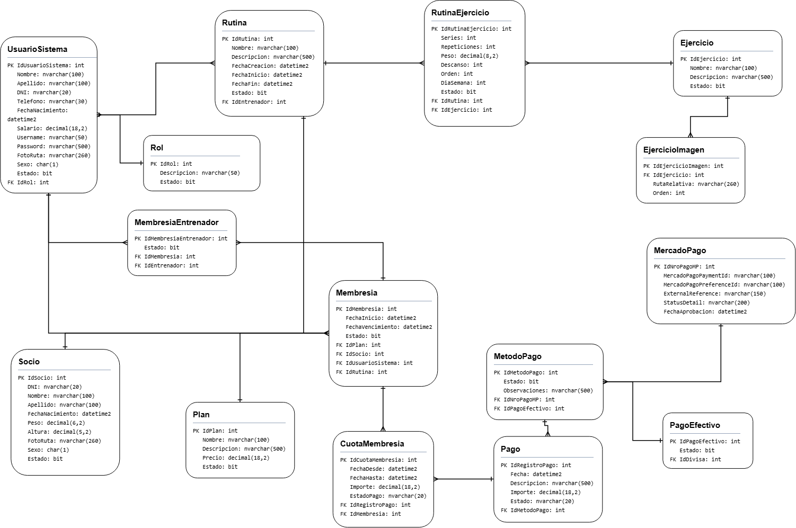

# SysGym - Taller 2

Aplicación de escritorio para la gestión de un gimnasio, desarrollada en C# con Windows Forms, .NET Framework 4.8, Entity Framework 6 y SQL Server, como parte de Taller 2.

SysGym reúne la administración de socios, personal, planes, membresías, cuotas y pagos con la organización del entrenamiento: asignación de entrenadores, catálogo de ejercicios, rutinas semanales y exportación a PDF. Cada usuario accede a un panel según su rol.

Última actualización: 22 de septiembre de 2026.

## Usuarios del sistema y salario

`UsuarioSistema` representa al personal que utiliza la aplicación. Los socios son las personas que entrenan en el gimnasio y se administran por separado.

| Rol | Funciones principales |
| --- | --- |
| Administrador | Gestionar usuarios y roles, socios, planes, membresías, pagos y asignaciones; consultar y administrar rutinas y ejercicios; acceder al resumen general y los reportes. |
| Recepcionista | Gestionar socios, membresías y cuotas, registrar pagos, asignar entrenadores y consultar sus alumnos. |
| Entrenador | Consultar **Mis alumnos**, asignar rutinas, crear rutinas personalizadas, gestionar sus rutinas y ejercicios, y exportar la rutina del alumno a PDF. |

El inicio de sesión verifica las credenciales y abre el panel correspondiente. Las contraseñas se almacenan mediante hash **Argon2id**. El personal puede tener una foto de perfil opcional; el encabezado muestra los datos de la sesión y permite cambiar de cuenta.

Cada usuario debe registrar un **salario mensual**:

- En C# se almacena en `UsuarioSistema.Salario` como `decimal`.
- En SQL Server se almacena como `UsuarioSistema.Salario DECIMAL(18,2) NOT NULL`.
- Al crear o editar un usuario desde **Administración → Usuarios y roles**, el salario debe ser mayor que cero.
- En la base inicial, el salario se carga según los datos de prueba y puede modificarse desde la aplicación.

## Actualización de la base de datos

- Para crear una base nueva, ejecutar [SysGymDB.sql](capaDatos/Database/SysGymDB.sql). El script crea las tablas, relaciones, restricciones, índices y datos iniciales.
- La conexión se configura en [App.config](App.config): `GymContext` apunta a `.\SQLEXPRESS` y `GymContextRespaldo` a `localhost,1433`, ambas con autenticación de Windows y la base `SysGymDB`.
- Entity Framework tiene deshabilitada la creación automática de la base. Los cambios de esquema deben mantenerse coordinados con las entidades y su mapeo.
- Para bases anteriores que no tengan la tabla de imágenes de ejercicios, existe la migración puntual [MigrarEjercicioImagen.sql](capaDatos/Database/MigrarEjercicioImagen.sql).

El DDL principal es para una base limpia. No ejecutar el script completo sobre una base existente: la migración de imágenes solo cubre esa tabla y el proyecto no incluye una actualización general de todos los esquemas anteriores.

### Datos iniciales

La carga inicial incluye roles y usuarios de prueba, planes, 30 socios, 82 ejercicios, 26 rutinas, 66 imágenes de ejercicios y ejemplos de membresías, cuotas y pagos. También incluye fotos del personal y casos sin rutina o entrenador asignado para recorrer las distintas funciones.

Las cuotas de ejemplo corresponden a septiembre de 2026; su condición de deuda depende de la fecha en que se ejecute la aplicación.

### Diagrama entidad-relación (DER)

El diagrama muestra las entidades del gimnasio y sus relaciones:

[](Resources/SysGymDB.png)

Hacé clic en la imagen para verla en tamaño completo. El esquema vigente está definido en `SysGymDB.sql`: el campo `IdDivisa` que todavía aparece en `PagoEfectivo` en la imagen ya fue eliminado del modelo actual.

## Funcionalidades

### Socios y planes

- Alta, consulta y edición de socios, con búsqueda, DNI único, datos personales, peso, altura y cálculo del IMC.
- Foto opcional y consulta de la rutina semanal desde la ficha del socio.
- Baja lógica y reactivación de socios, conservando su historial. La baja también desactiva su membresía; reactivar al socio no reactiva automáticamente la membresía.
- Administración de planes con nombre, descripción, precio y estado.
- Validaciones de datos personales y valores numéricos: edad mínima de 13 años para socios y 18 para el personal; precios, salarios e importes mayores que cero.

### Membresías, cuotas y pagos

- Cada socio conserva una membresía histórica vinculada a su plan. Al crearla se genera la primera cuota en la misma operación.
- Las cuotas representan períodos mensuales y conservan el importe del plan al momento de generarse. **Generar cuota** agrega el período siguiente sobre la misma membresía, con control de duplicados.
- Dos o más cuotas pendientes vencidas inactivan al socio y su membresía, y bloquean la generación de nuevas cuotas. La reactivación es manual y requiere quedar por debajo de ese límite de deuda.
- **Cuotas y pagos** permite consultar períodos, importes y estados, y registrar pagos con método **Efectivo** o **Mercado Pago**.
- Solo los pagos aprobados se contabilizan. La pantalla también muestra los estados de anulación y reembolso.

La membresía mantiene su fecha de alta; los períodos de cobro pertenecen a las cuotas. `FechaVencimiento` permanece en la tabla `Membresia` por compatibilidad, pero no se utiliza como vencimiento mensual ni se muestra en su ficha.

Actualmente, una cuota vinculada a un pago anulado o reembolsado no admite un nuevo pago sobre esa misma cuota.

### Entrenadores y rutinas

- Asignación opcional de entrenador por membresía y consulta de los socios asignados a cada entrenador.
- Inicio del entrenador en **Mis alumnos**, con acceso a sus membresías y rutinas.
- Catálogo compartido de rutinas: los entrenadores pueden consultar y asignar las rutinas activas; solo el autor o un administrador activo pueden modificarlas.
- Asignación y cambio de rutinas existentes, o creación de una rutina personalizada para un socio sin rutina asignada.
- Organización semanal de lunes a viernes, con ejercicios, orden, series, repeticiones, peso y descanso.
- Una rutina puede utilizarse en varias membresías; los cambios sobre esa rutina se reflejan en todas las que la tienen asignada.

### Ejercicios, imágenes y PDF

- Gestión del catálogo de ejercicios y galería de hasta cuatro imágenes ordenadas por ejercicio.
- Procesamiento de imágenes con validación de formato, tamaño y resolución, corrección de orientación y normalización a 800 × 800 píxeles.
- Fotos e imágenes almacenadas como archivos; SQL Server conserva sus rutas relativas.
- Exportación de la rutina asignada en **PDF A4 horizontal**, organizada por día, con logo de SysGym, socio, entrenador cuando corresponda y nombre de la rutina.
- Cada ejercicio del PDF muestra su nombre y observaciones, series, repeticiones, peso, descanso y primera imagen según el orden del catálogo. Si no tiene imagen o esa primera imagen no puede cargarse, se muestra **Sin imagen** y se informa el aviso.

Las imágenes iniciales están en `capaDatos/Imagenes` y se copian a `Datos/Imagenes` junto al ejecutable al compilar. Las nuevas fotos e imágenes cargadas desde la aplicación deben respaldarse junto con la base de datos.

### Inicio administrativo y reportes

- Resumen general y consulta del estado de cuenta de los socios.
- Reportes básicos con cantidades de socios y usuarios activos, membresías habilitadas, rutinas activas y ejercicios disponibles.
- Pronóstico del clima para **Corrientes Capital** mediante Open-Meteo, con temperatura, probabilidad de lluvia y respaldo local de la última consulta.
- Navegación por módulos dentro del panel de cada rol, con encabezado compartido y acceso para volver al inicio.

## Arquitectura del proyecto

El proyecto organiza las responsabilidades en tres capas. Las operaciones de persistencia siguen este recorrido:

```text
capaVisual → capaLogica → capaDatos → Entity Framework 6 → SQL Server
```

| Carpeta | Contenido |
| --- | --- |
| `capaVisual` | Formularios y controles Windows Forms de autenticación, administración, recepción y entrenamiento. |
| `capaLogica` | Reglas de negocio, validaciones, coordinación de operaciones, procesamiento de imágenes, clima y exportación de rutinas. Incluye las utilidades compartidas de navegación y presentación. |
| `capaDatos` | Entidades, contexto EF6, repositorios, unidad de trabajo, scripts SQL e imágenes iniciales. |
| `Resources` | Logo, icono y diagrama de la base de datos. |

Los formularios solicitan las operaciones a la lógica; el acceso a SQL Server se realiza desde la capa de datos mediante Entity Framework. Las operaciones compuestas, como el alta de membresía con su primera cuota, utilizan transacciones.

## Requisitos y ejecución

- Windows y .NET Framework 4.8.
- Visual Studio con las herramientas de desarrollo de escritorio de .NET y soporte para la solución `.slnx`; también se puede abrir directamente `exxen2.0.csproj`.
- SQL Server o SQL Server Express y una herramienta para ejecutar el script, como SQL Server Management Studio.
- Restauración de los paquetes NuGet del proyecto: Entity Framework 6.4.4, PDFsharp/MigraDoc, Argon2 e Imazen.WebP con sus componentes nativos.
- Conexión a internet para restaurar paquetes y actualizar el pronóstico del clima.

1. Abrir [exxen2.0.slnx](exxen2.0.slnx) o [exxen2.0.csproj](exxen2.0.csproj) en Visual Studio.
2. Crear la base nueva con `capaDatos/Database/SysGymDB.sql`.
3. Ajustar las conexiones de `App.config` a la instancia de SQL Server disponible y comprobar que el usuario de Windows tenga acceso a la base.
4. Restaurar los paquetes NuGet y compilar la solución.
5. Ejecutar el proyecto e iniciar sesión con un usuario registrado.

Para probar una base recién creada, el script incluye estas cuentas, con contraseña de prueba `Prueba123!`:

| Usuario | Rol |
| --- | --- |
| `klaus.schneider` | Administrador |
| `greta.hoffmann` | Recepcionista |
| `lukas.becker` | Entrenador |

Estos accesos corresponden a los datos iniciales; si se modificaron desde la aplicación, deben utilizarse las credenciales actualizadas.
